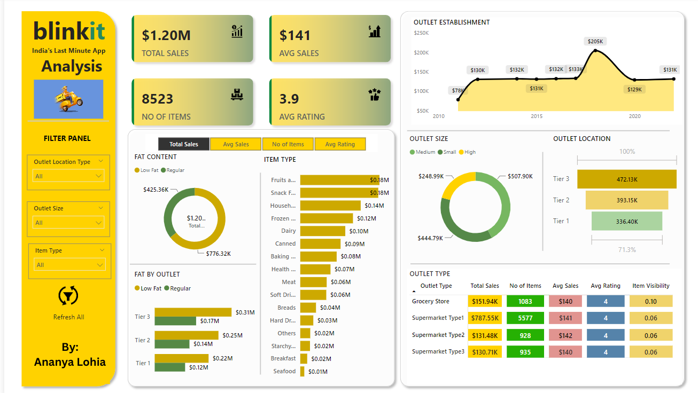

# Blinkit Analysis: Data-Driven Insights for Sales Performance, Customer Satisfaction, and Inventory Distribution

## Dashboard Preview

## Overview of the Project
This project aims to develop a comprehensive Power BI dashboard to analyze Blinkit's sales performance, customer satisfaction, and inventory distribution. By utilizing various Key Performance Indicators (KPIs) and visualizations, the dashboard provides critical insights and identifies opportunities for optimization. This dashboard is designed to aid decision-making by highlighting trends and patterns in the data.

## Project Stages

### 1. Requirement Gathering
- **Objective:** Understand the business requirements and the key metrics to be tracked.
- **Tasks:**
  - Conduct meetings with stakeholders to gather detailed requirements.
  - Identify the main KPIs that are important for business decisions.
  - Define the scope and objectives of the analysis.

### 2. Data Walkthrough
- **Objective:** Familiarize with the data structure, fields, and data types.
- **Tasks:**
  - Review the dataset to understand the available fields and their relationships.
  - Identify any data quality issues or missing data points.
  - Document the data fields and their significance.

### 3. Data Connection
- **Objective:** Connect Power BI to the data source.
- **Tasks:**
  - Ensure access to the data source (e.g., database, Excel file, CSV file).
  - Establish a connection between Power BI and the data source.
  - Verify the connection and ensure data is being imported correctly.

### 4. Data Cleaning/Quality Check
- **Objective:** Ensure data accuracy and completeness.
- **Tasks:**
  - Identify and handle missing values, duplicates, and outliers.
  - Standardize data formats (e.g., date formats, numeric formats).
  - Validate data accuracy by cross-checking with source data.

### 5. Data Modeling
- **Objective:** Structure the data for efficient analysis.
- **Tasks:**
  - Create relationships between different tables in Power BI.
  - Define the data model to support the required analysis.
  - Optimize the data model for performance.

### 6. Data Processing
- **Objective:** Transform the data to prepare it for analysis.
- **Tasks:**
  - Create calculated columns and measures as needed.
  - Perform data aggregations and summarizations.
  - Ensure the data is in the right format for visualization.

### 7. DAX Calculations
- **Objective:** Create advanced calculations using Data Analysis Expressions (DAX).
- **Tasks:**
  - Define measures for KPIs such as Total Sales, Average Sales, Number of Items, and Average Rating.
  - Implement complex DAX formulas to derive insights.
  - Validate DAX calculations for accuracy.

### 8. Dashboard Layout
- **Objective:** Design an intuitive and user-friendly dashboard layout.
- **Tasks:**
  - Plan the layout of the dashboard, including the placement of filters, charts, and KPIs.
  - Ensure the layout supports easy navigation and data interpretation.
  - Use consistent colors, fonts, and design elements.

### 9. Charts Development and Formatting
- **Objective:** Develop and format visualizations to effectively represent the data.
- **Tasks:**
  - Create the required charts as per the defined KPIs and objectives.
  - Format charts for readability (e.g., axis labels, legends, tooltips).
  - Apply conditional formatting to highlight key insights.

### 10. Dashboard/Report Development
- **Objective:** Integrate all components into a cohesive dashboard.
- **Tasks:**
  - Combine all charts, KPIs, and filters into a single dashboard.
  - Ensure interactivity between different visual elements.
  - Test the dashboard to ensure it meets the requirements.

### 11. Insights Generation
- **Objective:** Analyze the dashboard to generate actionable insights.
- **Tasks:**
  - Review the visualizations to identify trends, patterns, and anomalies.
  - Document key findings and insights.
  - Prepare a report summarizing the analysis and recommendations.

## Key Performance Indicators (KPIs)

### 1. Total Sales
- **Definition:** The overall revenue generated from all items sold within a specified period.
- **Importance:** Provides a direct measure of the business's revenue performance, helping to gauge overall financial health.
- **Calculation:** Sum of sales revenue from all transactions.
- **Usage in Dashboard:** Displayed prominently to show the total revenue generated.
- **Value:** $1.20 million

### 2. Average Sales
- **Definition:** The average revenue per sale.
- **Importance:** Helps in understanding the average transaction value, which can indicate the effectiveness of sales strategies and pricing.
- **Calculation:** Total sales revenue divided by the number of transactions.
- **Usage in Dashboard:** Provides insights into the typical value of transactions, helping to identify trends in customer spending behavior.
- **Value:** $141

### 3. Number of Items
- **Definition:** The total count of different items sold within a specified period.
- **Importance:** Tracks the volume of items sold, offering insights into product popularity and inventory turnover.
- **Calculation:** Count of all items sold.
- **Usage in Dashboard:** Helps in understanding product demand and stock management.
- **Value:** 8,523

### 4. Average Rating
- **Definition:** The average customer rating for items sold, usually on a scale from 1 to 5.
- **Importance:** Provides an indication of customer satisfaction and product quality.
- **Calculation:** Sum of all customer ratings divided by the number of ratings received.
- **Usage in Dashboard:** Highlights overall customer satisfaction and helps identify areas for improvement.
- **Value:** 3.9

## Dashboard Charts

### 1. Total Sales by Fat Content (Donut Chart)
- **Objective:** Analyze the impact of fat content on total sales.
- **Description:** This chart displays the total sales segmented by low fat and regular fat content, providing insights into the sales performance of products with different fat contents.
- **Reason for Use:** Donut charts are effective for showing proportions and percentages, making them ideal for understanding the relative impact of fat content on total sales.
- **Usage:** Helps in understanding consumer preferences regarding fat content and assists in product positioning and marketing strategies.

### 2. Total Sales by Item Type (Bar Chart)
- **Objective:** Identify the performance of different item types in terms of total sales.
- **Description:** This chart highlights the total sales for various item types, allowing for comparison and identification of high-performing product categories.
- **Reason for Use:** Bar charts are suitable for comparing discrete categories and making it easy to identify which item types generate the most revenue.
- **Usage:** Assists in inventory management and identifying which product categories drive the most revenue.

### 3. Fat Content by Outlet for Total Sales (Stacked Column Chart)
- **Objective:** Compare total sales across different outlets segmented by fat content.
- **Description:** This chart stacks the total sales of low fat and regular fat content items by outlet, providing a clear view of how different outlets perform based on the fat content of products sold.
- **Reason for Use:** Stacked column charts are useful for visualizing data breakdowns across categories and understanding the relative performance of each category within each outlet.
- **Usage:** Enables analysis of outlet performance and customer preferences at different locations.

### 4. Total Sales by Outlet Establishment (Line Chart)
- **Objective:** Evaluate how the age or type of outlet establishment influences total sales.
- **Description:** This chart shows the trend of total sales over time, categorized by the establishment year of the outlet, helping to identify any correlation between outlet age and sales performance.
- **Reason for Use:** Line charts are effective for displaying trends over time and understanding how sales evolve with the age of outlets.
- **Usage:** Useful for strategic planning and understanding the lifecycle of outlet performance.

### 5. Sales by Outlet Size (Donut/Pie Chart)
- **Objective:** Analyze the correlation between outlet size and total sales.
- **Description:** This chart represents total sales distribution across different outlet sizes, providing insights into how outlet size impacts sales.
- **Reason for Use:** Donut and pie charts are ideal for showing proportions and comparing the share of sales across different outlet sizes.
- **Usage:** Helps in evaluating the effectiveness of different outlet sizes and optimizing resource allocation.

### 6. Sales by Outlet Location (Funnel Map)
- **Objective:** Assess the geographic distribution of sales across different locations.
- **Description:** This map visualizes total sales by outlet location, offering a geographical perspective on sales performance.
- **Reason for Use:** Funnel maps provide a visual representation of data across geographic locations, making it easier to analyze regional performance.
- **Usage:** Facilitates regional analysis and helps in identifying high and low-performing locations.

### 7. All Metrics by Outlet Type (Matrix Card)
- **Objective:** Provide a comprehensive view of all key metrics (Total Sales, Average Sales, Number of Items, Average Rating) broken down by different outlet types.
- **Description:** This matrix card consolidates all critical KPIs by outlet type, allowing for a detailed comparison of different outlet categories.
- **Reason for Use:** Matrix cards are effective for presenting multiple metrics in a structured format, enabling detailed comparisons and analyses.
- **Usage:** Offers a holistic view of outlet performance and supports comparative analysis for strategic decision-making.

## Observations and Insights

### 1. Total Sales by Fat Content (Donut Chart)
- **Observation:** This chart provides insights into consumer preferences for low-fat versus regular-fat products.
- **Insights:**
  - **Consumer Preferences:** If there is a higher proportion of sales for low-fat products, it indicates a consumer preference for healthier options. Conversely, a higher proportion of regular-fat product sales might suggest a preference for taste over health.
  - **Product Positioning:** Understanding consumer preferences can help in positioning products effectively and tailoring marketing campaigns to emphasize popular product attributes.

### 2. Total Sales by Item Type (Bar Chart)
- **Observation:** The bar chart highlights the total sales for different item types, allowing for comparison between categories.
- **Insights:**
  - **High-Performing Categories:** Identify item types that generate the most revenue, which can inform inventory management and restocking strategies.
  - **Marketing Focus:** Concentrate marketing efforts on high-performing categories to maximize revenue.

### 3. Fat Content by Outlet for Total Sales (Stacked Column Chart)
- **Observation:** The stacked column chart shows total sales segmented by fat content across different outlets.
- **Insights:**
  - **Outlet Performance:** Compare the performance of outlets based on the fat content of products sold, helping to understand regional preferences.
  - **Stock Management:** Adjust inventory based on the fat content preferences of customers in different locations.

### 4. Total Sales by Outlet Establishment (Line Chart)
- **Observation:** The line chart displays the trend of total sales over time categorized by the establishment year of the outlet.
- **Insights:**
  - **Lifecycle Analysis:** Understand how sales evolve with the age of outlets, which can inform decisions on when to refurbish or rebrand outlets.
  - **Sales Trends:** Identify any correlations between outlet age and sales performance, helping in strategic planning.

### 5. Sales by Outlet Size (Donut/Pie Chart)
- **Observation:** The donut/pie chart represents the distribution of total sales across different outlet sizes.
- **Insights:**
  - **Optimal Outlet Size:** Determine which outlet size generates the most sales, aiding in the planning of future outlet expansions.
  - **Resource Allocation:** Allocate resources efficiently based on the performance of different outlet sizes.

### 6. Sales by Outlet Location (Funnel Map)
- **Observation:** The funnel map visualizes total sales by geographic location, providing insights into regional performance.
- **Insights:**
  - **Regional Performance:** Identify high and low-performing regions, helping in regional strategy formulation.
  - **Market Expansion:** Plan market expansion or retraction based on the sales performance of different locations.

### 7. All Metrics by Outlet Type (Matrix Card)
- **Observation:** The matrix card provides a comprehensive view of all key metrics broken down by outlet type.
- **Insights:**
  - **Comparative Analysis:** Compare the performance of different outlet types across multiple metrics, aiding in strategic decision-making.
  - **Performance Benchmarking:** Use the metrics to benchmark performance and set targets for different outlet types.

## Conclusion
The Blinkit Analysis Dashboard provides a detailed and comprehensive view of Blinkit's sales performance, customer satisfaction, and inventory distribution. By leveraging various visualizations and KPIs, the dashboard offers actionable insights that can drive strategic business decisions and optimize overall performance. The structured approach to building the dashboard ensures data accuracy and relevance, making it a valuable tool for stakeholders.

## 🧑‍💻 Author

**Ananya Kumar Lohia**  
Final Year ECE @ NIT Jamshedpur  
📬 [LinkedIn](https://www.linkedin.com/in/ananyakrlohia/) | ✉️ [Email](mailto:ananyatworkk@gmail.com)
